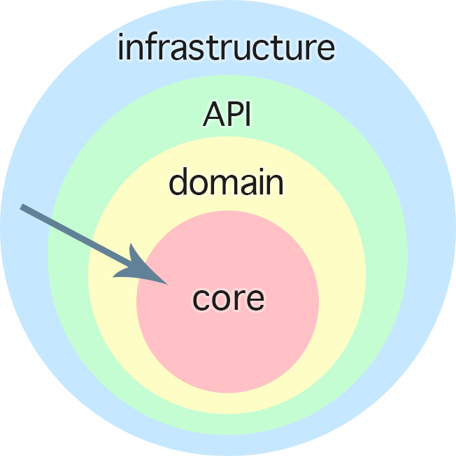

# Application Structure that Enhances Testability
This .NET Core 5 REST API demonstrates proper application structure for testing.

## Introduction
What kind of testing are we taling about here? We could talk about Testing in the broadest sense of the word all day long, probably for 3 days or more.
There are two basic types of testing: *Blackbox* testing and *Whitebox* testing.
- Blackbox (aka *System* and *Integration*) Tests: Ensure that a production system is functioning as expected from end to end. These tests do not require a knowledge of the code or the application's internal structure, and can be run by people who are not developers.
- Whitebox testing, on the other hand, does require a working knowledge of the application, and is therefore done by developers during the development cycle.

## Why Unit Tests?
As our title implies, today we'll be focusing primarily on the latter category. 
- With Unit tests, you as the developer and the rest of your team are the consumers. 
  - The external API is for external tests and end users; but the internal API is just as important.
  - A clean internal API will go a long way in helping you to define and maintina a clean public API.
    - When your public API needs to change, you can do so freely because your internal structure is very composable (more on that later).
- Unit tests are easier to write, easier to read, and run faster.
  - This shorter feedback loop maximizes developer efficiency. Suggested goal for execution speed: 1 ms, 1000 tests per second

## The Onion Architecture

- Also known as the "Bicylce wheel design"
  - Core in the center.
  - Meat (business rules, domain model, on the Inside.
  - I/O (storage, UI (interactions with the world)) on the Outside.
  - Why?
    - "Your business rules and your UI will change for differernt reasons." - Rob C. Martin
    - Specifics of I/O change. (Database type, etc.)
    - You don't control "the world". You may receive ***bad input***. We don't want to deal with the error-handling all over your code. Keep it on the outside.
    - Your business rules will change less often. (See [domain-driven design](https://en.wikipedia.org/wiki/Domain-driven_design))
    - The domain itself (the problem you are solving) should basically be set in stone already.
- We're interested in testing the domain layer.
  - These will be the functions that make up your *sub*s, *classes*, *services, *modules*, etc.
  - Does not include storage or UI-layer testing.
    - Exception to UI is the MVU architecture, where most of the UI is considered part of the domain model.

## Test Scope
- Now that we understand *what* we're testing, why does the scope of my test matter?
  - Too narrow scope will break frequently during refactoring ("One reason to change")
  - Too broad scope encourages deep "nesting" of dependencies
  - Eliminating interlocking dependencies from your service graph only goes a long way toward achieving this goal.
- The scope of the modules under test has a direct bearing on the scope of a given test itself.
  - We need to find the sweet middle-ground where we are testing "Unit(s) of Functionality"
  - At the same time, we must flatten the dependency graph as much as possible.
    - The [Single Responsibility Principle](https://en.wikipedia.org/wiki/Single-responsibility_principle)
      - ["One reason to change"](https://blog.cleancoder.com/uncle-bob/2014/05/08/SingleReponsibilityPrinciple.html).
    - [Separation of Concerns](https://en.wikipedia.org/wiki/Separation_of_concerns)
      - Return the data as soon as possible, to be handled outside your function, rather than consuming it immediately.

## Pure vs Impure code
Define 'pure' vs 'impure'. Pure code is free from side effects.
- Integration tests are for impure code, and may fail due to missing dependencies (not portable)
- Pure code is testable across multiple platforms (unit tests).
  - In agile development workflows, unit tests increase confidence when run on CI/CD pipelines, for example
- Pure code takes all dependencies as arguments, which makes them easier to mock, stub, etc.
  - Dependencies cloud the source of a bug. Timing issues (race conditions), etc.
  - Mocking in a unit test narrows the scope of the problem: The test either passes or fails.
    - [Example from the forum](https://codeblocks.olivetree.software/t/getting-people-interested-in-testing/471/20?u=ode2code) of a pure unit test.
- Get rid of [Shared Mutable State](https://2ality.com/2019/10/shared-mutable-state.html)
  - Employ the copy-and-update strategy.
  - Read-only functions (and values) are fine, if you need them (in F#, this would be done through [partial application](https://en.wikipedia.org/wiki/Partial_application)).  

## Function Signatures
Some of this may be more applicable to strongly typed languaes. Those of you JS fans out there, just know that with 'great power comes great responsibility.'
- *Honest* function signatures
  - No exceptions;
  - ALWAYS return status in return value.
  - Error state is anticipated via the return type (Type system enforces error handling)
    - No more (Assert.DoesNotThrow(() => { throw new InvalidOperationException(); });)
- Proper type scope (easier mock data for tests)
  - Accept as wide a type as possible
  - Accept as little data as possible
  - Don't use a collection/wrapped/boxed type when you can enumerate at a higher level.
  - Proper I/O structure (above) REDUCES the number of functions that have to deal with errors.
  - Return as strict a type as possible
  - Make your functions more composable.

## Takeaways:
- Properly structured code makes writing tests easier, and the intent of the tests clearer, so that maintaining the tests doesn't become so expensive in terms of time.
- *Well-built* tests make excellent documentation. Readable tests are a critical component of this objective.
- Tests enable confident releases amid iterative releases in agile workflows.
- So, do I have to ditch OOP paradigms and start over from scratch?
  - No. But FP idioms can help you craft better, less imperative code, while still being OOP.
  - Static, pure functions, etc.

## Resources:
- https://dotnetcoretutorials.com/2021/06/19/mocks-vs-stubs-vs-fakes-in-unit-testing/
- https://codeblocks.olivetree.software/t/getting-people-interested-in-testing/471
- https://lispcast.com/what-is-the-onion-architecture/
- https://mozaicworks.com/blog/functional-programming-makes-domain-driven-design-easy/
- https://elmish.github.io/elmish (MVU for F# WPF)
- https://github.com/louthy/language-ext

